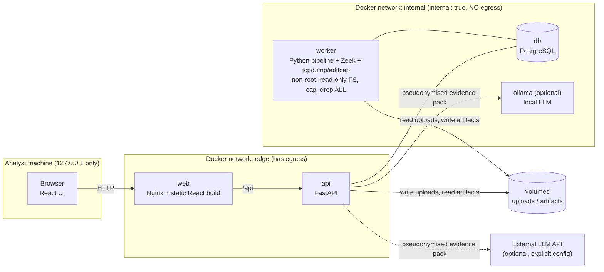
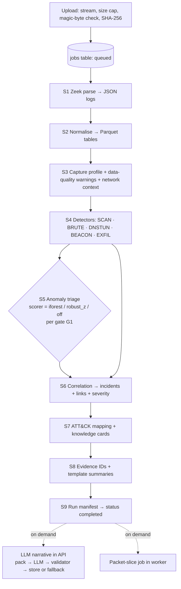
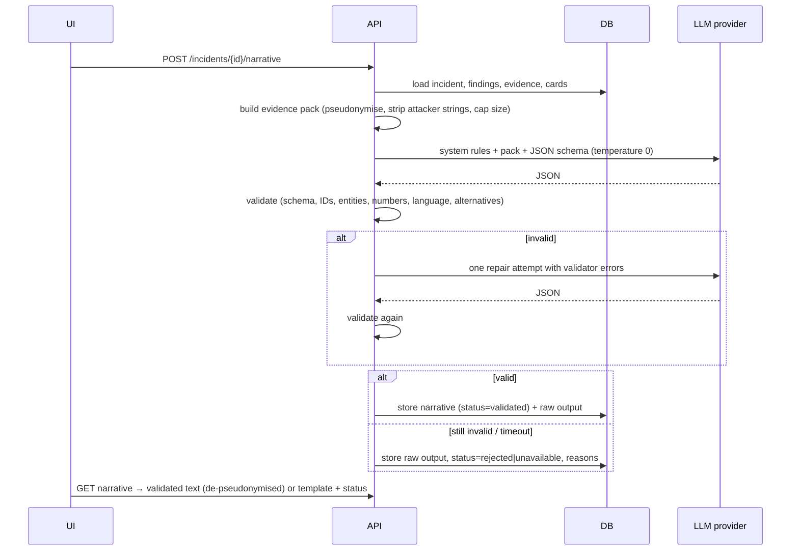

# Tracewright — Technical Architecture

| Field | Value |
|---|---|
| Document | architecture.md v1.0 |
| Implements | `PRD.md` v1.0 |
| Style | Modular monolith: one API process, one worker process, one database |

---

## 1. System overview

Tracewright turns one PCAP into a ranked set of evidence-backed incidents. The system is deliberately small:

- **Worker** (Python + Zeek + tcpdump/editcap/capinfos): the only component that touches capture bytes. Runs the analysis pipeline. No internet egress.
- **API** (FastAPI): uploads, queries, packet-slice job requests, reports, feedback, and (optionally) LLM narrative generation.
- **PostgreSQL**: investigations, jobs, findings, evidence, incidents, anomalies, narratives, feedback.
- **Artifact volume**: original uploads (read-only to worker), Zeek logs, Parquet tables, packet slices.
- **Web** (Nginx serving a React build, reverse-proxying `/api`).
- **Ollama** (optional Compose profile `llm`).

Both Python processes share one codebase (`backend/app`) and one domain model. There is no message broker, cache, vector store, or model registry, because no requirement needs one.

## 2. Architecture diagrams

### 2.1 Containers and trust boundaries



The API sits on both networks; the worker and database sit only on `internal`. **Untrusted capture bytes are parsed only inside the egress-less worker.** LLM calls originate from the API and carry only pseudonymised structured data.

### 2.2 Analysis pipeline



### 2.3 Narrative generation sequence



## 3. Component responsibilities

| Module (`backend/app/…`) | Responsibility | Runs in |
|---|---|---|
| `api/` | REST routers, request validation, auth token check, streaming upload | API |
| `core/` | Settings (env vars via Pydantic), logging, constants, errors | both |
| `db/` | SQLAlchemy models, sessions, Alembic migrations | both |
| `ingest/` | File validation, hashing, Zeek runner, log normalisation | worker (validation also in API) |
| `profile/` | Capture profile, data-quality warnings, network context resolution | worker |
| `detect/` | Detector interface + five detectors | worker |
| `anomaly/` | Entity-window features, scorers (`robust_z`, `iforest`), promotion | worker |
| `correlate/` | Incident grouping, links, severity | worker |
| `attack/` | STIX loader, mapping validation, knowledge cards, playbooks | worker (cards read by API) |
| `explain/` | Evidence IDs, templates, evidence pack, pseudonymiser, LLM client, validator | worker (templates), API (narrative) |
| `slice/` | Packet-slice filter builder and runner | worker |
| `report/` | Markdown/HTML report rendering | API |
| `worker/` | Job loop, stage orchestration, timeouts, run manifest | worker |

Every detector implements:

```python
class Detector(Protocol):
    id: str            # e.g. "DET-SCAN"
    version: str       # bump on any logic or default change
    def run(self, tables: CaptureTables, ctx: NetworkContext, cfg: DetectorConfig) -> list[Finding]: ...
```

Detectors are pure functions of their inputs (no DB access, no I/O), which makes them unit-testable on small DataFrames.

## 4. Data flow between components

| From → To | Data | Format | Notes |
|---|---|---|---|
| Browser → API | PCAP upload | multipart stream | size cap enforced while streaming |
| API → volume | original file | `uploads/<uuid>.pcap` | client filename stored only as metadata |
| API → DB | investigation row, job row | SQL | status `queued` |
| Worker ← DB | job lease | `SELECT … FOR UPDATE SKIP LOCKED` | lease timeout 30 min |
| Worker → volume | Zeek logs | JSON lines in `artifacts/<inv>/zeek/` | |
| Worker → volume | normalised tables | Parquet in `artifacts/<inv>/tables/` | conn, dns, http, ssl, x509, ssh, ftp, weird |
| Worker → DB | profile, warnings, findings, evidence samples, anomalies, incidents, links, summaries, manifest | SQL (JSONB for metrics) | API reads only DB for analysis results |
| API → worker (via DB) | slice job | jobs row type `slice` | result written to `artifacts/<inv>/slices/` |
| API → LLM | evidence pack | JSON | pseudonymised, size-capped |
| API → Browser | results, slices, reports | JSON / file download | capture-derived strings escaped by UI |

## 5. PCAP ingestion

1. **Upload (API).** Stream to a temp file under the uploads volume; abort beyond `MAX_UPLOAD_BYTES` (default 500 MB). Read the first 4 bytes and accept only:
   - PCAP: `d4 c3 b2 a1`, `a1 b2 c3 d4` (µs), `4d 3c b2 a1`, `a1 b2 3c 4d` (ns)
   - PCAPNG: `0a 0d 0d 0a`
   Reject everything else (including gzip `1f 8b`). Compute SHA-256 while streaming. Rename to `<uuid>.pcap[ng]`. Check free disk space before accepting.
2. **Zeek parse (worker, stage S1).**
   `zeek -C -D -r <file> <site-policy> LogAscii::use_json=T` in a per-investigation directory, with a stage timeout (default 15 min). `-C` ignores checksum errors common in captures from offloading NICs; `-D` zeroes Zeek's random seeds so connection UIDs, and therefore all downstream output, repeat across runs (NFR-02; verified in P1 on Zeek 9.0.0, where unseeded runs produced different UIDs). The child process receives a minimal environment (no database credentials) and stderr is written to `logs/zeek.stderr.txt`. *Observed on Zeek 9.0.0 / P1:* a truncated PCAP makes Zeek exit 1 (`failed to read a packet … truncated dump file`) after writing partial logs, so it is reported as `failed` at `zeek_parse`; a valid capture with zero packets exits 0 with no `conn.log` (reported as `completed` with `NOTHING_TO_ANALYSE`). `capinfos` reads gzip files transparently, so compressed-file rejection must happen in validation, before any tool runs. The site policy loads only the analyzers needed (conn, dns, http, ssl, x509, ssh, ftp, weird) and keeps password capture disabled (`FTP::default_capture_password` and `HTTP::default_capture_password` remain false).
3. **Packet counts.** `capinfos -M` for packet count, first/last timestamp, snaplen, and link type (used in the profile and warnings).
4. **Normalisation (S2).** Read JSON lines → typed pandas DataFrames → Parquet. Column names follow Zeek field names (`id.orig_h` → `orig_h`). Timestamps stored as UTC; durations as float seconds; missing numeric fields as nulls (not zero).

## 6. Packet/flow feature extraction

Tracewright does not implement its own flow assembler. Zeek's `conn.log` *is* the flow table (UID, 5-tuple, service, duration, bytes, packets, `conn_state`, `history`). Feature extraction happens on these tables:

- **Capture profile (S3):** span, counts, internal/external host sets (from `network.yaml` CIDRs), service mix, top talkers, DNS presence, `weird` counts by name, fraction of TCP connections lacking a handshake (`history` without `S`/`h`) as a one-sided-capture signal, snaplen truncation.
- **Data-quality warnings:** emitted as structured records `{code, severity, message, metric}`, e.g. `CAPTURE_SHORT_FOR_BEACONS` (reports max detectable interval = span / 10), `ONE_SIDED_TRAFFIC`, `WEAK_BASELINE_EXFIL`, `ANOMALY_POPULATION_SMALL`, `NO_DNS`.
- **Network context:** `config/network.yaml`

```yaml
internal_cidrs: [10.0.0.0/8, 172.16.0.0/12, 192.168.0.0/16]
known_hosts:
  scanners: [10.0.5.20]
  resolvers: [10.0.0.53]
  backup_servers: []
allowlist:
  domains: []           # registered domains suppressed for DET-DNSTUN/BEACON
  periodic_ports: [123] # NTP excluded from DET-BEACON by default
```

## 7. Detection pipeline

Detectors run in sequence on shared in-memory tables. Each produces `Finding` objects:

```text
Finding
  id, investigation_id, detector_id, detector_version
  type: SCAN | BRUTE | DNSTUN | BEACON | EXFIL | UNEXPLAINED_ANOMALY
  primary_entity, secondary_entities[]
  start_ts, end_ts
  metrics: {name: value}            # measured values
  thresholds: {name: value}         # values applied (from config)
  confidence: low | medium | high
  severity_base: float
  benign_causes: [str]
  evidence_refs: [zeek_uid | dns_key]  # full list in Parquet; 200-row sample in DB
  suppressed_by_allowlist: bool       # suppressed findings are counted, not shown
```

### 7.1 DET-SCAN
- Unit: source host; sliding analysis over 60 s and 10 min windows.
- Metrics: `distinct_dst_ports` per (src, dst), `distinct_dst_hosts` per (src, port), `failed_share` (conn_state ∈ {S0, REJ, RSTO, RSTR, RSTOS0, SH, OTH}).
- Fires on vertical (≥ 50 ports/60 s to one host), horizontal (≥ 20 hosts/60 s on one port) or slow vertical (≥ 100 ports/10 min). Confidence high if `failed_share ≥ 0.6`.
- Primary entity: the scanning source.

### 7.2 DET-BRUTE
- Unit: (src, dst, service) over 5-min windows.
- FTP: count `ftp.log` replies with code 530 → observed failures (high confidence).
- HTTP: count 401/403 to the same host+URI (high confidence).
- SSH/RDP/Telnet (encrypted or opaque): ≥ 10 connections, median duration < 30 s, coefficient of variation of `orig_bytes` < 0.3, and for SSH `auth_success != true` where Zeek reports it → medium confidence ("inferred from connection pattern").
- Spraying variant: same source, same service, ≥ 5 targets → T1110.003.
- Primary entity: source. Secondary: target(s).

### 7.3 DET-DNSTUN
- Unit: (client, registered domain). Registered domain via `tldextract` using its **bundled** public-suffix snapshot (`suffix_list_urls=()`), so no network fetch happens in the egress-less worker.
- Metrics: `unique_subdomains`, `mean_subdomain_len`, `mean_label_entropy` (Shannon, bits/char, over the non-registered part), `txt_null_share`, `nxdomain_rate`, `query_count`, `name_bytes_total`.
- Fires per PRD Section 10. Allowlisted suffixes suppressed.
- Primary entity: client.

### 7.4 DET-BEACON
- Unit: (src, dst IP, dst port, proto), and a second grouping (src, SNI or HTTP Host) to survive CDN IP rotation. Ports in `periodic_ports` are skipped.
- For connection start times `t₁…tₙ` (n ≥ 10) with inter-arrival times `d`:
  - `s_disp = max(0, 1 − MAD(d)/median(d))`
  - Bowley skewness `b = (Q3 + Q1 − 2·Q2)/(Q3 − Q1)` (0 if Q3 = Q1); `s_skew = 1 − |b|`
  - `s_size = max(0, 1 − MAD(bytes)/median(bytes))` (1 if all sizes equal)
  - `s_cov = min(1, (tₙ − t₁) / (0.5 · capture_span))`
  - `beacon_score = mean(s_disp, s_skew, s_size, s_cov)` (weights configurable)
- Approach follows the timing/size-regularity scoring popularised by open-source beacon analysers such as RITA; implemented here from first principles and unit-tested on synthetic series.
- Limitation recorded in code and docs: HTTP(S) keep-alive beacons that reuse one TCP connection are invisible at connection level; for cleartext HTTP, `http.log` request timestamps are used as an additional series.

### 7.5 DET-EXFIL
- Unit: (internal src, external dst IP or SNI) pairs; requires network context.
- Robust baseline: modified z-score on `log1p(outbound_bytes)` across all internal→external pairs in the capture: `z = 0.6745·(x − median)/MAD`.
- Fires when outbound ≥ floor (50 MB), z ≥ 3.5, out/in ≥ 5. If fewer than 20 pairs, z is not computed; only the floor applies, with low confidence and `WEAK_BASELINE_EXFIL`.
- Hosts listed as `backup_servers` destinations are suppressed (counted).

### 7.6 Implementation notes (P3, detectors v1.0.0)

Code: `backend/app/detect/` (`base` Finding/Detector/helpers, `config` strict loader + config hash, `windows`, one module per detector, `runner`), thresholds in `config/detectors.yaml` (every value is the PRD §10 initial default; **none has been tuned or measured**). Stage S4 (`worker/pipeline.py`) runs the detectors after profiling and writes `findings.json`; suppressed-finding counts are also written to `profile.json` (`suppressed_findings`, FR-13). `evidence_refs` holds the first 200 unique Zeek uids (time order) and `evidence_count` the total; DNS findings cite the dns row's connection uid. `severity_base` is `base[type]` from §9; confidence is **medium** wherever the documents define only the `high` condition (SCAN, DNSTUN, BEACON, SSH/RDP/Telnet BRUTE) and **low** only for EXFIL without a baseline.

Where the documents were ambiguous, the choice made (revisit when real attack captures exist):

| Topic | Choice |
|---|---|
| SCAN | One finding per (source, scan type, target) using the earliest window with the most distinct values; `slow_vertical` is reported only if `vertical` did not fire for the same source/host pair; horizontal findings list at most 50 targets (the metric carries the true count). |
| BRUTE spraying | "Same source, same service, ≥ 5 targets" is read as ≥ 5 distinct destinations among that source's firing findings for the service; each target must itself meet the per-target threshold (no lower bar was specified). HTTP failures group by host + URI; URIs and hosts are grouping keys only and are never stored. SSH `auth_success == true` connections are excluded from the pattern set. |
| DNSTUN | Subdomain length/entropy are means over the **unique** subdomain strings (dots excluded for entropy); TXT/NULL share and NXDOMAIN rate are over all queries. High confidence needs rule A with both the entropy and the length criterion. Allowlist entries must be **registered** domains (an entry deeper than the registered domain never matches). Unknown suffixes (e.g. `.test`) fall back to the last two labels. |
| BEACON | Only internal sources (§9 primary-entity rule). Series: ip, TLS-name/HTTP-Host, and http.log request times; duplicates of the same connections are reduced to one finding. Periodic-port and allowlisted-domain series are scored, then suppressed and counted. Bytes = orig + resp bytes per connection (body lengths per request for http). |
| EXFIL | Only connections started by the internal host count as outbound. "50 MB" = 50,000,000 bytes. With < 20 pairs only the byte floor applies (not the ratio), at low confidence. Modified-z falls back to the mean absolute deviation when MAD = 0. A TLS/HTTP-name grouping is reported only when the IP grouping does not already cover its connections. |

Known limitations (documented, not fixed): HTTPS/TLS beacons that keep one TCP connection open are invisible at connection level; DET-EXFIL ignores external-initiated sessions; with `config/network.lab.yaml` the lab clients' ext-net addresses (172.21.0.101-103) classify as *external*, so the lab's `CLOUD_SYNC_UPLOAD` hard negative cannot exercise DET-EXFIL (observed on dev run b05); the connection-level beacon score fires on regular benign traffic (see `eval/datasets.md`, dev observations).

Not built in P3 (listed in plan P3, deferred): DB persistence of findings (`investigations`, `findings`, `evidence_items`, `jobs`, Alembic): it belongs with the DB-backed job queue and upload endpoint (P6); until then findings are JSON files. The M1 baseline (`baseline-rules-v1`: test-split run, dev-only tuning log) is **not** produced because the attack corpus does not exist.

## 8. ML pipeline — residual anomaly triage

> **Why it exists → input → processing → output → evaluation → failure mode**

**Why it exists.** The five detectors only cover named behaviors. The anomaly layer tests whether host behavior that no detector explains can be surfaced usefully. It is the only ML in the system and is gated (G1): it ships only if it beats a simple robust-statistics baseline on held-out attack families.

**Input.** Entity-windows: one row per (internal host, 5-minute tumbling window) with any activity. Features v1 (16):

| # | Feature | Transform |
|---|---|---|
| 1 | outbound connection count | log1p |
| 2 | inbound connection count | log1p |
| 3 | distinct destination IPs | log1p |
| 4 | distinct destination ports | log1p |
| 5 | failed-connection share | none |
| 6 | bytes out | log1p |
| 7 | bytes in | log1p |
| 8 | out/in byte ratio | log((out+1)/(in+1)) |
| 9 | mean connection duration | log1p |
| 10 | external-destination share | none |
| 11 | established connections with no Zeek-recognised service (share) | none |
| 12 | non-standard destination port share | none |
| 13 | DNS query count | log1p |
| 14 | distinct queried registered domains | log1p |
| 15 | mean DNS label entropy | none |
| 16 | ICMP connection count | log1p |

Log transforms matter for Isolation Forest (split points are drawn uniformly between feature min and max, so heavy tails dominate otherwise); linear scaling does not. The robust-z scorer uses per-feature median/MAD.

**Processing.**
1. Mark windows that overlap (same host, overlapping time) any detector finding as *rule-explained*.
2. Fit the scorer **only on rule-unexplained windows** (prevents high-volume attacks from swamping the population and focuses the model on what rules miss); score all windows.
3. Scorers:
   - `robust_z`: score = max over features of |modified z|; MAD = 0 features fall back to mean absolute deviation × 1.2533, or are skipped if constant.
   - `iforest`: `sklearn.ensemble.IsolationForest(n_estimators=200, max_samples="auto", random_state=SEED)`; score = −`score_samples` (higher = more anomalous). No `contamination` thresholding; ranking plus a dev-calibrated cut-off instead.
   - `off`: stage skipped.
4. Explanation for every scored window (both scorers): top-3 features by |modified z|, with the window value and capture median. Deterministic and honest; SHAP is not used.
5. Promotion: rule-unexplained windows above the dev-calibrated threshold (chosen so ≤ 1% of BENIGN dev windows exceed it), capped at top 10, consecutive windows of the same host merged → `UNEXPLAINED_ANOMALY` findings (severity low, confidence low, no ATT&CK mapping).
6. Skip with `ANOMALY_POPULATION_SMALL` if < 100 rule-unexplained windows.

**Output.** `anomaly_scores` rows (window, score, rank, explained flag, top features) and promoted findings.

**Evaluation.** Section 20.3 (held-out families, precision@10, recall@10, PR-AUC, benign promoted rate, bootstrap CI, comparison vs `robust_z` and random). G1 decides `ANOMALY_SCORER`.

**Failure modes.**
| Failure | Effect | Mitigation |
|---|---|---|
| Benign-but-rare behavior ranks high (backup job, OS update burst) | Analyst noise | Cap of 10, low severity, wording "unusual relative to this capture", feature explanation, feedback |
| Real attack mostly explained by rules | Not promoted (by design) | Rules already cover it |
| Small lab population | Unstable ranks | Minimum population; warning |
| IF no better than robust-z | No ML value | G1 ships robust-z or off; result documented |
| Feature drift between lab and real captures | Calibrated threshold off | Threshold re-calibration documented as a limitation; never tuned on test |

## 9. Event correlation

**Primary entity rules.** SCAN/BRUTE → source (the actor; may be external). DNSTUN/BEACON/EXFIL/UNEXPLAINED_ANOMALY → internal source host (the possibly affected host).

**Grouping.** Per primary entity, sort findings by start; a finding joins the current incident if `start ≤ incident_end + GAP` (default 30 min); otherwise it starts a new incident.

**Typed links (cross-incident, deterministic):**
| Link | Rule | Meaning shown to analyst |
|---|---|---|
| `TARGET_LATER_ACTIVE` | BRUTE secondary entity = H, and an incident with primary entity H starts after the BRUTE finding began | "Host targeted by login attempts later showed suspicious activity" |
| `SHARED_EXTERNAL_PEER` | BEACON and EXFIL findings share destination IP or SNI | "Beaconing and large outbound transfer to the same destination"; EXFIL mapping gains T1041 |
| `SAME_ACTOR_LATER` | Same primary entity, beyond GAP | "Same source active again later" |

**Storyline.** Linked incidents can be viewed as one combined timeline (UI only; incidents remain separate records).

**Severity (ordering aid, documented formula).**
`finding_score = base[type] × w[confidence]` with base SCAN 2, BRUTE 3, DNSTUN 4, BEACON 4, EXFIL 5, UNEXPLAINED_ANOMALY 1 and w low 0.5, medium 0.75, high 1.0.
`incident_score = max(finding_score) + 0.5 × (distinct types − 1) + 1.0 if it is the target side of a TARGET_LATER_ACTIVE link or participates in a SHARED_EXTERNAL_PEER link`, capped at 10. Buckets: < 2.5 low, < 4.5 medium, < 6.5 high, else critical.

## 10. MITRE ATT&CK mapping

- **Source of truth:** the official ATT&CK Enterprise STIX 2.1 bundle (from the `mitre-attack/attack-stix-data` repository), version pinned in `config/attack.yaml` with its SHA-256. Downloaded by `scripts/fetch_attack.py` during setup (outside the worker), stored on the artifacts volume.
- **Mapping file** `config/attack_mapping.yaml`:

```yaml
attack_version: "<pinned>"
mappings:
  SCAN:    [{id: T1046, phrase: "consistent with network service discovery"}]
  BRUTE:   [{id: T1110.001, when: "single_target"}, {id: T1110.003, when: "spray"}]
  DNSTUN:  [{id: T1071.004}, {id: T1048, when: "high_outbound_name_volume"}]
  BEACON:  [{id: T1071.001, when: "http_or_tls"}, {id: T1071.004, when: "dns"}, {id: T1071, when: "other"}]
  EXFIL:   [{id: T1048}, {id: T1041, when: "shared_peer_with_beacon"}]
  UNEXPLAINED_ANOMALY: []
```

- **Startup validation:** every ID must exist in the pinned bundle and must not be revoked or deprecated; failure stops the worker with a clear error. A unit test enforces the same.
- Mapping is **"consistent with"**, never attribution.

### 10.1 Implementation notes (P4)

Stages after the detectors: `correlate` (S6, `app/correlate/`: gap grouping, three typed links, the §9 severity formula, constants in `config/correlation.yaml`) and `explain` (S7-S8: ATT&CK references, stable `E-n` evidence IDs, Jinja template summaries, Markdown report, run manifest). Outputs next to `findings.json`: `incidents.json` (ranked incidents with findings, techniques, cards, playbook IDs, evidence, summary, links), `report.md`, `manifest.json` (versions, config hashes and counts, no timestamps, so two runs write identical files).

- **Pinned bundle and cards.** `scripts/fetch_attack.py` downloads `enterprise-attack-19.2.json` (54 MB, SHA-256 pinned in `config/attack.yaml`, stored under gitignored `data/attack/`); `scripts/build_cards.py` derives `knowledge/cards/19.2/` (8 cards + `index.json` recording the bundle version, checksum and each technique's revoked/deprecated flags). The worker validates `config/attack_mapping.yaml` against that index at startup and before every analysis (every ID present, none revoked or deprecated, mapping/index/pin versions and checksum equal), so the 54 MB file is not needed at runtime. A test checks the index against the real bundle whenever it has been downloaded.
- **Mapping conditions** (`conditions:` in `config/attack_mapping.yaml`): PRD §10 gives no number for "high outbound name volume"; `1000000` bytes is an unmeasured initial default (tune on dev only). BEACON families use port lists (web: 80/443/8000/8080/8443, dns: 53); a TLS-name series is treated as web.
- **Shared peer.** SHARED_EXTERNAL_PEER matches the destination exactly as the two findings record it (IP with IP, name with name); an IP-keyed beacon and a name-keyed exfil to the same server are not matched. Both findings in one incident produce no link row but still add T1041 and the severity bonus.
- **Evidence.** Per incident: aggregates (finding metrics and thresholds) first, then up to 20 records per finding ordered by time; sentences cite the aggregate plus at most two records. Report text derived from the capture is markdown-escaped; `<`, `>`, `[`, `]`, `|`, backtick and `\` cannot form markup.
- **Playbooks** (`knowledge/playbooks/DET-*.md`, IDs `K-PB-DET-*`) are hand-written; technique cards carry no detection text because the pinned bundle's techniques have no `x_mitre_detection` field.

## 11. Knowledge base

No vector store. Knowledge is addressed by key.

| Item | ID format | Content | Source |
|---|---|---|---|
| Technique card | `K-T1046` | name, description (trimmed), detection notes, linked mitigations (`M…` names), ATT&CK URL | pinned STIX bundle, generated by `scripts/build_cards.py` |
| Verification playbook | `K-PB-DET-SCAN` | what to check in Wireshark/Zeek, filters to apply, common benign explanations, data that would confirm or refute | hand-written Markdown in `knowledge/playbooks/` |

Cards are generated once per ATT&CK version and stored as JSON; the UI shows them on incidents; the evidence pack includes short excerpts of cards mapped to that incident.

## 12. RAG pipeline

**Removed.** Retrieval is a deterministic lookup: finding type → technique IDs → cards; detector ID → playbook. A similarity search would only add a way to retrieve the wrong document. If the stretch feature S1 (grounded incident Q&A) is built, it reuses the incident's evidence pack and its cards as context (small enough to fit in one prompt) and the same validator — still no embeddings.

## 13. LLM explanation pipeline

> **Why it exists → input → processing → output → evaluation → failure mode**

**Why it exists.** Templates produce faithful per-finding sentences but no synthesis. A narrative that relates findings, proposes benign alternatives, and orders next checks may save analyst time. It exists only if G2 shows it is preferred over templates while staying faithful.

**Template summary (always, worker stage S8).** Jinja templates per finding type, e.g.:
> `{{src}}` attempted connections to `{{distinct_dst_ports}}` distinct ports on `{{dst}}` within `{{span_s}}` s; `{{failed_pct}}`% received no reply or were rejected (threshold: `{{threshold_ports}}` ports in 60 s). [E-3, E-4]

**Input — evidence pack.** Built in the API from DB rows:

```json
{
  "incident": {"id": "I-7", "severity": "high", "span": "T+02:10 → T+41:55"},
  "capture": {"span_min": 58, "warnings": ["ONE_SIDED_TRAFFIC"], "max_beacon_interval_s": 348},
  "entities": {"H1": "internal", "H2": "internal", "X1": "external", "D1": "domain"},
  "findings": [
    {"fid": "F-1", "type": "BEACON", "confidence": "high", "entity": "H2",
     "metrics": {"connections": 37, "median_interval_s": 60.2, "beacon_score": 0.93},
     "thresholds": {"min_connections": 10, "beacon_score": 0.8},
     "evidence": ["E-11", "E-12"]}
  ],
  "evidence": {
    "E-11": {"kind": "aggregate", "fields": {"connections": 37, "median_interval_s": 60.2, "dst": "X1", "dst_port": 443}},
    "E-12": {"kind": "conn", "fields": {"t": "T+02:10", "src": "H2", "dst": "X1", "dst_port": 443, "bytes_out": 412}}
  },
  "knowledge": {"K-T1071.001": "Adversaries may communicate using web protocols…"},
  "links": [{"type": "SHARED_EXTERNAL_PEER", "with": "I-8"}]
}
```

Rules for building the pack: IPs → `H<n>`/`X<n>`; domains/SNI/Host → `D<n>`; times relative to capture start; **no** query names, URIs, user agents, certificate subjects or any free-text field from the capture; at most 40 evidence items (aggregates first, then up to 3 sample records per finding); total ≤ ~6k tokens.

**Processing.**
- Prompt version stored (`explain/prompts/narrative_v1.txt`, hash in manifest). System rules: use only the pack; every statement cites IDs; observed = only what evidence shows; inferences hedged, with confidence and ≥ 1 benign alternative; never state that a host is compromised or an attack confirmed; output JSON only.
- Provider client: one small interface (`generate(system, user, schema) -> str`) with `none`, `ollama`, `openai_compatible`, `anthropic` implementations via `httpx`; temperature 0; timeout 120 s.
- **Validator** (deterministic, `explain/validator.py`):
  1. Parse against the Pydantic output schema.
  2. Every cited `E-`/`K-`/`F-` ID exists in the pack; `K-` IDs belong to this incident's mapped techniques/playbooks.
  3. Entity check: every `H\d+`, `X\d+`, `D\d+` token and every port/number in `observed[*].statement` appears in the fields of its cited evidence (numbers within ±1%, with unit normalisation for bytes/seconds/percent).
  4. Every inference has `confidence ∈ {low, medium, high}` and ≥ 1 `alternative_explanations` entry.
  5. Banned verdict patterns (case-insensitive) anywhere: `is compromised`, `has been compromised`, `confirmed (attack|breach|compromise)`, `definitely`, `proves`, `without (a )?doubt`, `\binfected\b`.
  6. No real IPs/domains present (pseudonym leak check in reverse — guards against the model copying from knowledge text).
- On failure: one repair call including the validator error list; on second failure or timeout → fallback.

**Output.** Stored JSON + validation status (`validated`, `rejected`, `unavailable`) + reasons + raw output + provider/model/prompt hash. The UI de-pseudonymises tokens for display and renders citation chips that scroll to the evidence row.

**Output schema.**

```json
{
  "summary": "string (hedged)",
  "observed": [{"statement": "string", "evidence_ids": ["E-…"]}],
  "inferences": [{"statement": "string", "supporting_ids": ["E-…","F-…"], "knowledge_ids": ["K-…"],
                  "confidence": "low|medium|high", "alternative_explanations": ["string"]}],
  "recommendations": [{"action": "string", "rationale_ids": ["E-…","K-…"]}],
  "open_questions": ["string"]
}
```

**Evaluation.** Section 20.4; G2 decides whether the narrative feature is enabled in the default configuration.

**Failure modes.**
| Failure | Effect | Mitigation |
|---|---|---|
| Invented number/host | Misleading statement | Entity/number check rejects |
| Overconfident verdict | Analyst over-trusts | Banned-language check; mandatory alternatives |
| Plausible but weak inference | Subtle misdirection | Labeled "inference", confidence shown, manual-audit metric; residual risk documented |
| Prompt injection from capture strings | Model hijack | Attacker strings never enter the pack; model has no tools or actions |
| Provider down/slow | No narrative | Template fallback |
| Privacy leak to external API | Data exposure | Pseudonymisation; default provider `none`; explicit opt-in |

## 14. Evidence grounding (system-wide)

- Findings store metrics, thresholds and evidence refs at creation; nothing downstream invents values.
- At stage S8, each incident's evidence items get stable IDs `E-1…E-n` (aggregates first, then records ordered by time) persisted in `evidence_items.local_id`.
- Templates, UI, reports and narratives all cite the same IDs; a report reader can trace every sentence to a row.
- Packet slices let the analyst verify the raw packets behind any finding.

## 15. Database & storage

**PostgreSQL schema (core tables):**

| Table | Key columns |
|---|---|
| `investigations` | id (uuid), original_name, sha256, size_bytes, status, stage, error, created_at, profile (jsonb), warnings (jsonb), manifest (jsonb) |
| `jobs` | id, investigation_id, type (`analyze`/`slice`), status, attempts, lease_until, params (jsonb), error |
| `findings` | id, investigation_id, incident_id, type, detector_id, detector_version, primary_entity, secondary_entities (jsonb), start_ts, end_ts, metrics (jsonb), thresholds (jsonb), confidence, severity_score, benign_causes (jsonb), evidence_total, suppressed |
| `evidence_items` | id, finding_id, incident_id, local_id (`E-n`), kind, zeek_uid, ts, fields (jsonb) |
| `incidents` | id, investigation_id, primary_entity, start_ts, end_ts, severity_score, severity_label, template_summary |
| `incident_links` | from_incident, to_incident, type, reason |
| `technique_refs` | finding_id, technique_id, phrase |
| `anomaly_scores` | investigation_id, host, window_start, scorer, score, rank, rule_explained, top_features (jsonb) |
| `narratives` | incident_id, status, output (jsonb), raw_output, reasons (jsonb), provider, model, prompt_hash, created_at |
| `feedback` | finding_id, label, note, created_at |
| `slices` | id, finding_id, status, path, size_bytes |

**Files:** `artifacts/<investigation_id>/{zeek/, tables/*.parquet, slices/, logs/}`; originals in `uploads/` (read-only mount in worker). Deleting an investigation removes rows (cascade) and both directories.

## 16. API design

Base path `/api/v1`. JSON; errors as `{"error": {"code", "message"}}`.

| Method & path | Purpose |
|---|---|
| `POST /investigations` | multipart upload → `202 {id, status}` |
| `GET /investigations` | list with status |
| `GET /investigations/{id}` | status, stage, profile, warnings, manifest |
| `DELETE /investigations/{id}` | delete all data |
| `GET /investigations/{id}/incidents` | ranked incidents with links |
| `GET /investigations/{id}/anomalies` | scored windows (top 50) + promoted findings |
| `GET /incidents/{id}` | incident, findings, techniques, cards, template summary, links |
| `GET /incidents/{id}/evidence?finding_id=&limit=&offset=` | evidence samples with `E-` IDs |
| `POST /incidents/{id}/narrative` | start generation → `202` |
| `GET /incidents/{id}/narrative` | status + validated output or fallback info |
| `POST /findings/{id}/slice` | create slice job → `202 {slice_id}` |
| `GET /slices/{id}` | status; `GET /slices/{id}/download` returns the PCAP |
| `POST /findings/{id}/feedback` | `{label, note}` |
| `GET /incidents/{id}/report?format=md\|html` | report download |
| `GET /config/network` | effective network context (read-only in MVP; edited via file) |
| `GET /health` | DB + worker heartbeat |

Auth: if `API_TOKEN` is set, `Authorization: Bearer` required on all routes except `/health`.

## 17. Frontend architecture

- React + TypeScript (strict) + Vite; React Router; TanStack Query for fetching/polling; Apache ECharts for the timeline swimlane (the only charting dependency).
- Views:
  1. **Investigations** — upload dropzone, list with status/progress.
  2. **Overview** — capture profile, data-quality warnings, incidents table (severity, entity, span, finding types, links), anomaly list (labeled "unusual, not necessarily malicious").
  3. **Incident** — storyline timeline; finding cards ("why this fired": metric vs threshold bars, confidence, benign causes, playbook link, packet-slice button, feedback); evidence table with `E-` IDs; ATT&CK cards; summary panel (template; narrative tab with Observed / Inferences / Recommendations, citation chips, validation badge); report export.
- All capture-derived strings rendered as text (React escaping); `dangerouslySetInnerHTML` is forbidden by lint rule.
- API types generated from FastAPI's OpenAPI schema (`openapi-typescript`) to keep frontend and backend in sync.

## 18. Docker architecture

```yaml
# docker-compose.yml (abridged)
networks:
  internal: { internal: true }
  edge: {}

volumes: { pgdata: {}, uploads: {}, artifacts: {} }

services:
  db:
    image: postgres:16            # pin exact tag/digest
    networks: [internal]
    volumes: [pgdata:/var/lib/postgresql/data]
    env_file: .env

  worker:
    build: { context: ./backend, dockerfile: Dockerfile.worker }  # FROM pinned zeek/zeek LTS image
    networks: [internal]          # no egress
    user: "10001:10001"
    read_only: true
    tmpfs: [/tmp]
    cap_drop: [ALL]
    security_opt: ["no-new-privileges:true"]
    mem_limit: 6g
    cpus: 4
    pids_limit: 256
    volumes: [uploads:/data/uploads:ro, artifacts:/data/artifacts]
    env_file: .env

  api:
    build: { context: ./backend, dockerfile: Dockerfile.api }
    networks: [internal, edge]
    user: "10001:10001"
    read_only: true
    tmpfs: [/tmp]
    cap_drop: [ALL]
    volumes: [uploads:/data/uploads, artifacts:/data/artifacts:ro]
    env_file: .env

  web:
    build: ./frontend             # multi-stage: node build → nginx
    networks: [edge]
    ports: ["127.0.0.1:8080:80"]

  ollama:
    image: ollama/ollama          # pin tag
    profiles: [llm]
    networks: [internal]
    volumes: ["./data/ollama:/root/.ollama"]
```

- The worker image is built from a pinned Zeek LTS image plus Python (the minor version provided by that image's Debian base, ≥ 3.11), `tcpdump`, and the Wireshark CLI utilities (`editcap`, `capinfos`). The API image uses the same Python minor version.
- Ollama models are pulled once with a setup command before use (the container has no egress afterwards).
- A `docker-compose.dev.yml` override mounts source code and enables reload.
- `config/` is bind-mounted read-only at `/config` in the worker (`CONFIG_DIR=/config`). `Dockerfile.worker` has a non-default `test` target (dev dependencies + tests on top of the worker image) used to run integration tests against the real Zeek/capinfos binaries.
- P1 deviation, recorded: the DB-backed `jobs` table and lease loop are not part of P1 (plan P3/P6). Until then the worker is driven by `python -m app.cli analyze`, and the investigation lifecycle (`running` → `completed`/`failed`, stage, error code, per-stage timings) is written to `artifacts/<id>/status.json`, mirroring the planned `investigations.status/stage/error` columns.

## 19. Security boundaries & threat model

**Assets:** uploaded captures (may contain credentials/PII), derived evidence, analyst feedback, host integrity, API keys.

| Threat | Vector | Mitigation |
|---|---|---|
| Parser exploitation | Malformed PCAP targeting Zeek/tcpdump | Parsing only in worker: non-root, read-only FS, cap_drop ALL, no-new-privileges, resource limits, timeouts, no egress, pinned patched versions; fuzz corpus in tests |
| Data exfiltration after exploit | Compromised worker calls out | Worker on `internal: true` network |
| Upload abuse / DoS | Huge or many files | Streaming size cap, disk check, single worker queue, rejection of compressed files |
| Path traversal | Crafted filename | Server-generated UUID paths; filename stored as metadata only |
| XSS | DNS names/URIs/user agents rendered in UI or reports | React text rendering; lint ban on raw HTML; report escaping; CSP header in Nginx |
| Prompt injection | Attacker strings in DNS/HTTP/TLS fields | Never included in evidence pack; validator; LLM has no tools |
| Sensitive data to third parties | External LLM | Default `none`; pseudonymisation; explicit opt-in; no raw packets |
| Credential exposure | FTP/HTTP passwords in captures | Zeek password capture disabled; logs exclude payloads |
| Unauthorised access | Exposed port | Bind 127.0.0.1; optional bearer token; restricted CORS |
| Supply chain | Malicious dependency/image | Lockfiles, pinned tags/digests, minimal dependency set |
| Evidence tampering | Altered upload | SHA-256 recorded at upload and shown in report; originals read-only to worker |

## 20. Model & system evaluation architecture

### 20.1 Lab and ground truth
`lab/` contains a Compose topology (attacker, SSH/FTP/HTTP servers, DNS server for the tunnel domain, clients, benign generators) and scenario scripts. Captures are taken on the lab bridge with `tcpdump`. Each scenario script appends episodes to `labels.jsonl`:

```json
{"run_id":"r014","episode_id":"r014-e2","class":"BRUTE","tool":"hydra","params":{"service":"ssh","threads":4},
 "actor":"172.20.0.10","targets":["172.20.0.21"],"start":"2026-11-02T10:04:11Z","end":"2026-11-02T10:06:40Z"}
```

`eval/splits.yaml` assigns each run to `dev` or `test` before tuning (committed; changes require a note in `eval/REVISIONS.md`).

### 20.2 Detector evaluation
`eval/run_detectors.py --split test` runs the real pipeline (same code path as the product) on each capture, matches findings to episodes (entity overlap + time overlap with ±60 s tolerance), and writes `eval/results/<run_id>/detectors.json` with per-detector episode precision/recall, FP per benign hour (with and without allowlists), and the beacon detectability sweep.

### 20.3 Anomaly evaluation (gate G1)
`eval/run_anomaly.py` on LAB-HOLDOUT test captures and BENIGN captures: precision@10, recall@10 of held-out episodes, PR-AUC, benign promoted rate, for `iforest`, `robust_z`, and random; 1,000-sample bootstrap over captures for the difference in precision@10. Writes `anomaly.json` and a decision record (`eval/decisions/G1.md`) applying the PRD rule.

### 20.4 LLM evaluation (gate G2)
`eval/run_llm.py` generates narratives for ≥ 30 test incidents; records validator outcomes. `eval/audit/` holds a blinded labeling sheet (statement-level: supported / unsupported / citation correct) and a pairwise preference sheet (template vs narrative, order randomised). `eval/score_llm.py` computes G2 metrics and writes `eval/decisions/G2.md`.

### 20.5 Performance
`eval/bench.py` runs 50/200/500 MB captures, records per-stage timings and peak RSS.

All result files include the run manifest. Documentation and reports may only quote numbers from these files.

## 21. Failure handling

| Stage | Failure | Handling |
|---|---|---|
| Upload | invalid type/size/disk | 4xx with code; temp file deleted |
| S1 Zeek | non-zero exit / timeout | investigation `failed` at `zeek_parse`; stderr saved to `artifacts/<id>/logs/` |
| S2 | malformed log line | skip line, count in `normalise_skipped`; > 1% skipped → warning |
| S3–S8 | exception in a detector | that detector marked `error` in profile; other detectors continue; investigation `completed_with_errors` |
| S5 | population small | stage skipped, warning |
| S6–S8 | exception | investigation `failed` (incidents would be inconsistent) |
| Worker crash | lease expires | job requeued once; second failure `failed` |
| Slice | filter too broad / output > 100 MB | slice `failed` with reason |
| Narrative | provider error / invalid twice | status `unavailable` / `rejected`; template shown |
| Startup | invalid ATT&CK mapping | worker refuses to start |

## 22. Logging & observability

- JSON logs (stdlib `logging` with a JSON formatter) with `investigation_id`, `job_id`, `stage`, `duration_ms`, `level`, `event`.
- Never logged: payloads, credentials, evidence field dumps, LLM prompts (prompts are stored in `narratives` for evaluation, pseudonymised).
- Per-stage timings and counts persisted in the run manifest; visible in the UI's investigation details.
- `GET /health` reports DB connectivity and worker heartbeat (worker updates a heartbeat row every 15 s).
- No Prometheus/Grafana in MVP: a single-analyst offline tool has no service-level monitoring need.

## 23. Repository layout

```text
tracewright/
├── backend/
│   ├── app/{api,core,db,ingest,profile,detect,anomaly,correlate,attack,explain,slice,report,worker}/
│   ├── migrations/
│   ├── tests/{unit,integration,fixtures}/
│   ├── Dockerfile.api  Dockerfile.worker  pyproject.toml  uv.lock (or equivalent lockfile)
├── frontend/          # React + TS + Vite
├── config/            # network.yaml, detectors.yaml, attack.yaml, attack_mapping.yaml, zeek/site.zeek
├── knowledge/         # playbooks/*.md, cards/ (generated)
├── lab/               # topology, scenarios, label logger, capture scripts
├── eval/              # splits.yaml, run_*.py, results/, decisions/, audit/, REVISIONS.md
├── scripts/           # fetch_attack.py, build_cards.py, make_demo.py
├── docs/              # PRD.md, architecture.md, plan.md, instruction.md, adr/
├── docker-compose.yml  docker-compose.dev.yml  .env.example  README.md
```

## 24. Technology choices (and rejected options)

| Choice | Reason | Rejected |
|---|---|---|
| Zeek | Standard, fast, robust protocol logs; well understood by analysts | Scapy/PyShark pipeline (slow, fragile, larger custom attack surface) |
| FastAPI + Pydantic | Typed API, OpenAPI for frontend types | Django (heavier than needed) |
| PostgreSQL | Relational model, JSONB, `SKIP LOCKED` job queue | Redis/Celery (unneeded broker) |
| Parquet + pandas | Columnar bulk tables, simple | Spark/Dask (scale not needed) |
| scikit-learn | IF + utilities, reproducible | Deep learning (no justification), XGBoost (no supervised task) |
| Deterministic knowledge cards | Exact retrieval by technique ID | Vector DB + embeddings |
| httpx LLM client | One small interface, swappable providers | LangChain/agent frameworks (abstraction without need) |
| JSON experiment results + manifests | Reproducible, diffable | MLflow (infrastructure without need) |
| React + ECharts | Familiar, one charting dependency | Multiple UI/chart libraries |
